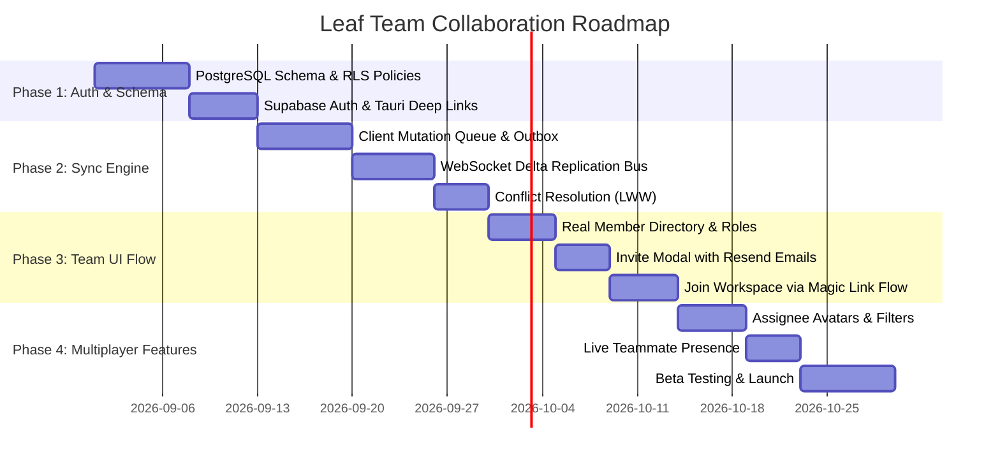

# Leaf Team Collaboration & Real-Time Sync Architecture

## 1. Executive Summary

Leaf is designed from day one as an **ultra-fast, local-first productivity tool**. To support team collaboration, we cannot adopt a traditional "cloud-only" CRUD architecture (which introduces network lag, spinners, and broken offline experiences). 

Instead, Leaf must follow the **Linear / Figma model**: **Local-First with Asynchronous Cloud Sync**.

### Core Tenets
1. **0ms Latency UI**: Every keystroke, task creation, and drag-and-drop operation commits immediately to the local database. The UI never waits on an HTTP response.
2. **Offline-Tolerant**: Teammates can board a flight, edit 50 tasks, check off checklists, and seamlessly merge changes when back online.
3. **Sub-second Multiplayer Sync**: When online, mutations are pushed over WebSockets and reflected on teammates' screens in < 150ms.
4. **Granular Role-Based Access Control (RBAC)**: Admin, Developer, Member, and Viewer permissions enforced cryptographically at the database layer.

---

## 2. Architecture Overview

```
┌────────────────────────────────────────────────────────────────────────┐
│                        Leaf Desktop (Tauri v2)                         │
│                                                                        │
│   ┌─────────────────────┐               ┌──────────────────────────┐   │
│   │    React UI Layer   │               │   Local Database Engine  │   │
│   │  (Instant Optimistic│ ────────────> │  (IndexedDB / SQLite)    │   │
│   │      Rendering)     │ <──────────── │  Source of Truth for App │   │
│   └─────────────────────┘               └─────────────┬────────────┘   │
│                                                       │                │
│                                           ┌───────────▼────────────┐   │
│                                           │  Local Mutation Queue  │   │
│                                           │  (Outbox: Pending Sync)│   │
│                                           └───────────┬────────────┘   │
└───────────────────────────────────────────────────────┼────────────────┘
                                                        │
                                    WebSockets & HTTPS  │ (Delta Replication)
                                                        │
┌───────────────────────────────────────────────────────▼────────────────┐
│                   Leaf Cloud Sync Gateway & Auth                       │
│                                                                        │
│   • Supabase Auth / Clerk (Magic Links & Google OAuth)                 │
│   • Transactional Mail Service (Resend for Team Invites)               │
│   • Row-Level Security (RLS) Policy Enforcement                        │
│   • Realtime WebSocket Broadcast Bus                                   │
└───────────────────────────────────────────────────────┬────────────────┘
                                                        │
┌───────────────────────────────────────────────────────▼────────────────┐
│                 PostgreSQL Relational Cloud Database                   │
│                                                                        │
│   • workspaces        • workspace_members (Admin/Dev/Member/Viewer)    │
│   • workspace_invites • projects                                       │
│   • items             • checklist_items                                │
└────────────────────────────────────────────────────────────────────────┘
```

---

## 3. Database Schema (PostgreSQL)

```sql
-- Workspaces
create table workspaces (
  id uuid primary key default gen_random_uuid(),
  name text not null,
  slug text unique not null,
  created_at timestamptz default now(),
  owner_id uuid not null references auth.users(id)
);

-- Workspace Members & Roles
create type member_role as enum ('owner', 'admin', 'developer', 'member', 'viewer');

create table workspace_members (
  id uuid primary key default gen_random_uuid(),
  workspace_id uuid references workspaces(id) on delete cascade,
  user_id uuid references auth.users(id) on delete cascade,
  role member_role not null default 'developer',
  joined_at timestamptz default now(),
  unique(workspace_id, user_id)
);

-- Invites & Tokens
create table workspace_invites (
  id uuid primary key default gen_random_uuid(),
  workspace_id uuid references workspaces(id) on delete cascade,
  email text not null,
  role member_role not null default 'developer',
  token text unique not null,
  invited_by uuid references auth.users(id),
  expires_at timestamptz not null,
  created_at timestamptz default now()
);

-- Projects
create table projects (
  id uuid primary key default gen_random_uuid(),
  workspace_id uuid references workspaces(id) on delete cascade,
  name text not null,
  color text not null default '#10b981',
  sort_order integer default 0,
  created_at timestamptz default now(),
  updated_at timestamptz default now()
);

-- Items (Backlog, Tasks, Bugs, Ideas)
create table items (
  id uuid primary key default gen_random_uuid(),
  workspace_id uuid references workspaces(id) on delete cascade,
  project_id uuid references projects(id) on delete set null,
  title text not null,
  content text default '',
  type text not null default 'task',
  priority text not null default 'none',
  status text not null default 'inbox',
  sort_order integer default 0,
  assignee_id uuid references auth.users(id) on delete set null,
  created_by uuid references auth.users(id),
  created_at timestamptz default now(),
  updated_at timestamptz default now(),
  version integer not null default 1
);

-- Checklist Items
create table checklist_items (
  id uuid primary key default gen_random_uuid(),
  item_id uuid references items(id) on delete cascade,
  text text not null,
  is_completed boolean default false,
  sort_order integer default 0,
  updated_at timestamptz default now()
);
```

---

## 4. Conflict Resolution & Sync Strategy

### Field-Level Last-Write-Wins (LWW)
1. Every record holds an `updated_at` ISO-8601 timestamp and an integer `version`.
2. When client mutations arrive at the cloud:
   - If incoming `updated_at > cloud.updated_at`, the write succeeds and triggers a realtime broadcast.
   - If incoming `updated_at < cloud.updated_at`, the cloud rejects the stale mutation and pushes the latest cloud record back to the client.
3. For **Checklists**: We treat each checklist line as an independent sub-entity with its own ID, preventing Alice's checklist additions from overwriting Bob's checkbox toggles.

---

## 5. Technology Stack Recommendations

| Component | Recommended Tool | Rationale |
| :--- | :--- | :--- |
| **BaaS / Database** | **Supabase (PostgreSQL)** | Instant Postgres with Row-Level Security, WebSockets, and authentication built in. Eliminates 80% of backend plumbing. |
| **Auth Provider** | **Supabase Auth** | Native support for Magic Links, Google OAuth, and session tokens. Seamless integration with desktop Tauri webviews. |
| **Email Delivery** | **Resend** | Fast, modern transactional email API for invite tokens and welcome emails with crisp HTML templates. |
| **Client Sync Layer** | **Custom SQLite / Dexie Outbox Engine** | Low dependency overhead, complete control over local persistence, and minimal bundle footprint in Tauri. |

---

## 6. Phased Implementation Roadmap



### Phase 1: Authentication & Cloud Foundations (2 Weeks)
- [ ] Set up Supabase project with PostgreSQL schema.
- [ ] Configure Row-Level Security (RLS) so users can only read/write data for workspaces they belong to.
- [ ] Implement Tauri deep-link protocol (`leaf://auth/callback`) to handle OAuth/Magic Link login redirects cleanly in the desktop window.
- [ ] Add Auth status & current profile to Leaf's `useLeafStore`.

### Phase 2: Local-First Sync Engine (2 Weeks)
- [ ] Build client **Mutation Outbox**:
  - Writes locally first.
  - Queues mutations in IndexedDB / SQLite with retry exponential backoff.
- [ ] Establish Supabase Realtime channel subscription:
  - Listens for `INSERT`, `UPDATE`, `DELETE` events on `items`, `projects`, `checklist_items`.
  - Merges incoming remote deltas into local store without UI stutter.
- [ ] Field-level Last-Write-Wins (LWW) conflict resolver.

### Phase 3: Team Management & Invite Flow (1.5 Weeks)
- [ ] Connect `TeamView.tsx` to live backend:
  - Fetch active members and their assigned roles (`Owner`, `Admin`, `Developer`, `Member`, `Viewer`).
- [ ] Integrate **Resend** for transactional invite emails:
  - Generates secure HMAC signed invite token with 7-day expiration.
  - Recipient clicks link -> opens Leaf -> auto-joins workspace.
- [ ] Add "Copy Invite Link" capability with permission verification.
- [ ] Member removal and role promotion/demotion for workspace Admins.

### Phase 4: Real-Time Team Collaboration Features (1.5 Weeks)
- [ ] **Task Assignees**: Assign team members to backlog tasks and queue cards with compact avatar indicators.
- [ ] **Assignee Filters**: Filter board by "Assigned to Me" or specific teammates.
- [ ] **Activity & Audit Stream**: Muted changelog on cards (e.g., "Sarah changed priority to High • 2m ago").
- [ ] **Multiplayer Presence**: Minimal online indicators showing which teammates are currently active in the workspace.

---

## 7. Cost & Infrastructure Projections

| Scale | Monthly Cost | Infrastructure Needed |
| :--- | :--- | :--- |
| **0 – 500 Active Users** | **$0 / mo** (Free Tier) | • Supabase Free Tier (500MB DB, 50k monthly active users, 200 concurrent WebSockets)<br>• Resend Free Tier (3,000 emails/mo) |
| **500 – 10,000 Active Users** | **~$25 – $45 / mo** | • Supabase Pro Tier ($25/mo: 8GB DB, 100k MAU, 500 concurrent connections)<br>• Resend Pro ($20/mo: 50,000 emails/mo) |
| **10,000+ Enterprise** | **~$150+ / mo** | • Supabase Team / Dedicated Compute<br>• Custom Sentry error tracking & Redis cache |

---

## 8. Summary & Next Steps
By following this plan, Leaf preserves **100% of its lightning-fast local performance** while opening up high-value team collaboration. 

Whenever you are ready to begin Phase 1, we can create the Supabase project configuration and add the database migration scripts.
